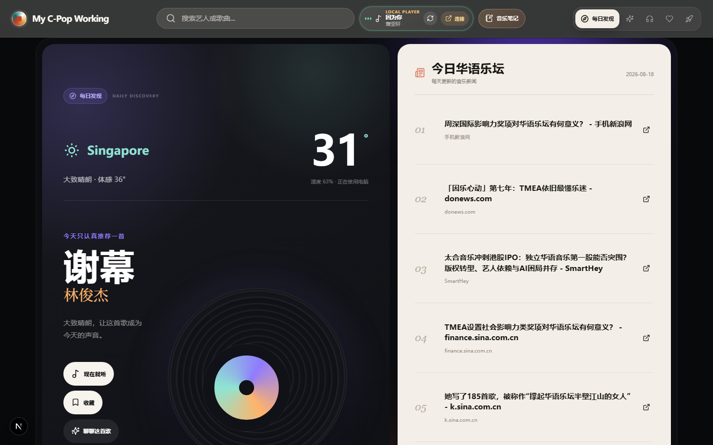
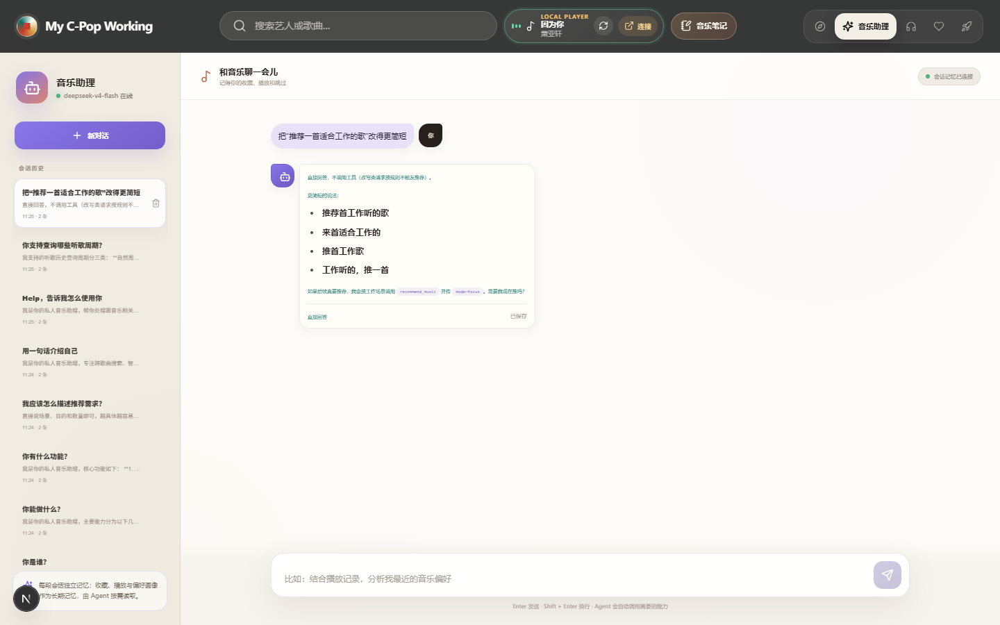
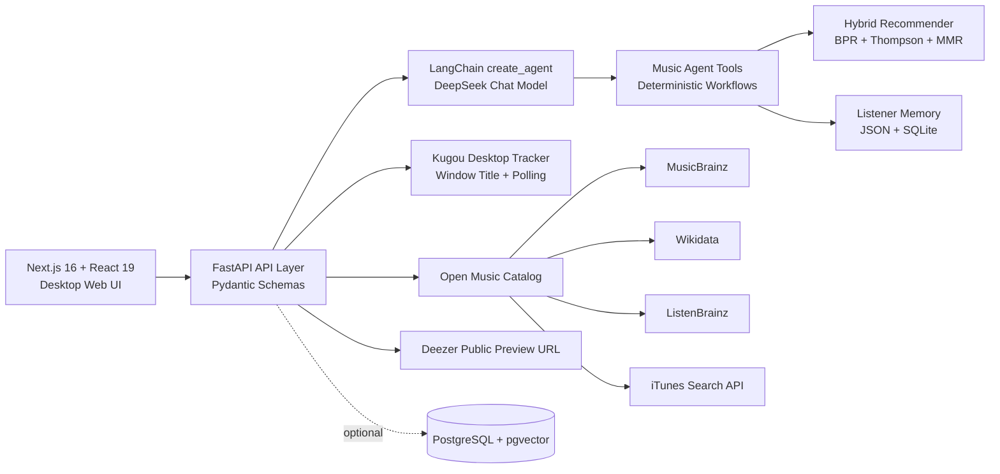

# My C-Pop Working


一个面向电脑工作场景的华语音乐工作台。它不是简单的歌单页面，而是把当前播放、听歌历史、个人偏好、天气新闻、开放音乐数据和大模型 Agent 串起来，做成一个可以陪你听歌、解释歌曲、记录习惯、生成推荐的本地音乐系统。

## 界面预览

| 首页每日发现 | 音乐助理 Agent |
| --- | --- |
|  |  |

## 为什么值得看

- **真实 Agent 编排**：DeepSeek 通过 OpenAI-compatible API 接入 LangChain `create_agent`，结合 LangGraph memory，完成模型判断、工具调用、observation 回填和多步决策。
- **推荐算法不是随机歌单**：`HybridRecommender` 使用多通道召回、BPR pairwise learning-to-rank、Thompson Sampling 探索和 MMR 多样性重排。
- **桌面播放状态接入**：Windows 下监听酷狗窗口标题和播放状态，后台轮询并按阈值增量记录听歌时长，不破解私有数据库。
- **本地记忆系统**：长期偏好存在轻量 JSON 状态中，真实听歌时长进入 SQLite，支持按天、周、月、年、自定义范围聚合。
- **工程化完整**：Next.js 16 + React 19 + TypeScript 前端，FastAPI + Pydantic 后端，Docker Compose、CI、自动数据同步 workflow 和 18 个后端测试文件。

## 体验入口

| 模块 | 能力 |
| --- | --- |
| 首页 | 今日推荐、熟悉答案、探索内容和个性化音乐入口 |
| 听歌房 | 读取当前酷狗播放，展示歌曲故事、短句分析、相似推荐和 Agent 对话 |
| 音乐助理 | 用自然语言搜索、推荐、解释歌曲，并返回工具调用 trace |
| 我的收藏 | 从文本、CSV、剪贴板导入歌单，只保存歌曲元数据 |
| 新世界 | 聚合 GitHub、AI 新闻、技术社区热点和学习向知识内容 |
| 听歌统计 | 查询今日、昨日、本周、本月、全年和自定义范围的听歌时长 |

## 系统架构



## 技术架构

### Frontend

- **Next.js 16 / React 19 / TypeScript**：以桌面端为主要使用场景，围绕音乐工作台、听歌房和助理对话组织信息密度。
- **TanStack Query**：统一前端请求、缓存和刷新节奏。
- **lucide-react**：提供一致的图标语言，适合工具型界面。
- **页面结构**：首页、搜索、歌曲页、听歌房、音乐助理、收藏、新世界。

### Backend

- **FastAPI + Pydantic**：模块化 API 层，覆盖推荐、Agent、收藏、开放曲库、酷狗桥接、听歌统计等能力。
- **异步 HTTP 聚合**：使用 `httpx` 访问 MusicBrainz、iTunes Search、Deezer preview 等公开数据源。
- **可测试降级**：没有大模型 Key 时仍可运行确定性 workflow 和测试，避免核心功能被外部服务完全锁死。

### Agent Layer

当前有 3 个由大模型驱动的 Agent：

| Agent | 职责 |
| --- | --- |
| `MusicAgent orchestrator` | 音乐问答、推荐、搜索和工具编排 |
| `ListeningCompanionAgent` | 听歌房右侧陪伴、收藏、笔记、相似推荐、歌词短句分析 |
| `SongPortraitAgent` | 歌曲资料检索、来源整理和情绪化歌曲画像 |

Agent 循环遵循：

```text
用户问题 -> 模型判断是否需要工具 -> 调用工具 -> observation 回填 -> 继续决策或生成最终回答
```

服务端会返回 `trace`、`tools_used`、`iterations`、`latency_ms` 等调试信息，便于判断 Agent 是否真的调用了工具，而不是只在文案里假装智能。

### Recommendation Layer

推荐链路由确定性 workflow 承担，Agent 只负责理解意图和选择工具：

1. **Multi-channel recall**：从 itemCF、用户画像、内容相似、上下文、热度和新鲜度召回候选。
2. **BPR ranking**：用隐式反馈做 pairwise 排序，让喜欢、收藏、跳过、曝光等信号进入排序。
3. **Thompson Sampling**：在稳定偏好之外保留探索，避免推荐池变成固定几首歌。
4. **MMR diversity**：控制相似歌曲扎堆，让结果兼顾相关性和多样性。
5. **Explainability**：返回文字理由和结构化 `score_breakdown`，便于前端展示推荐原因。

### Data & Memory

- **开放曲库**：合并项目 seed、MusicBrainz、Wikidata、ListenBrainz、iTunes Search API 和用户导入歌单。
- **用户状态**：`listener_state.json` 保存长期偏好、收藏、跳过、想听和歌词短句样本。
- **听歌历史**：SQLite `data/listening_history.db` 记录 daily track listening 和 daily summary，支持 legacy JSON 自动迁移。
- **向量扩展**：`migrations/001_init.sql` 提供 PostgreSQL + pgvector schema，`recordings.embedding` 使用 `vector(384)`。

### Desktop Integration

- 默认读取 Windows 酷狗当前播放信息。
- `KugouPlaybackTracker` 后台轮询，播放满 30 秒后增量记录，避免同一首歌被重复累计。
- 可选连接 `Yu9191/KuGou` 本地服务用于搜索和补全元数据。
- 项目不破解、不读取、不修改酷狗私有加密数据库。

## 快速开始

推荐 Windows 一键启动：

```powershell
.\scripts\dev-up.ps1
```

默认地址：

| 服务 | 地址 |
| --- | --- |
| Web | http://localhost:3000 |
| API | http://localhost:8001 |
| API Docs | http://localhost:8001/docs |

手动启动后端：

```powershell
cd backend
pip install -e ".[dev]"
python -m uvicorn app.main:app --host 0.0.0.0 --port 8001 --reload
```

手动启动前端：

```powershell
cd frontend
npm install
$env:NEXT_PUBLIC_API_BASE_URL="http://localhost:8001"
npm run dev -- --hostname 0.0.0.0 --port 3000
```

## 环境变量

复制 `.env.example` 为 `.env`，按需填写：

```env
DEEPSEEK_API_KEY=your_api_key_here
DEEPSEEK_MODEL=deepseek-v4-flash
DEEPSEEK_BASE_URL=https://api.deepseek.com

NEXT_PUBLIC_API_BASE_URL=http://localhost:8001
KUGOU_BRIDGE_URL=http://127.0.0.1:9191
```

没有 `DEEPSEEK_API_KEY` 时，LLM Agent 能力会受限，但曲库、统计、推荐 workflow 和大部分本地能力仍可开发调试。

## Docker

启动 Web + API：

```powershell
.\scripts\docker-up.ps1
```

检查 Docker/Compose 配置：

```powershell
.\scripts\docker-check.ps1
```

需要 PostgreSQL + pgvector：

```powershell
.\scripts\docker-up.ps1 -WithDb
```

Docker Compose 默认端口为 Web `3000`、API `8000`。本地开发脚本默认 API 端口是 `8001`。

## 关键 API

| API | 用途 |
| --- | --- |
| `GET /health` | 服务健康检查 |
| `GET /api/today?mode=auto` | 今日推荐和首页聚合 |
| `POST /api/agent/query` | Agent 自然语言问答 |
| `POST /api/agent/run` | Agent 执行入口 |
| `GET /api/agent/status` | Agent 状态、模型和工具信息 |
| `GET /api/agent/evaluate` | 固定题集评估工具选择、关键字命中、循环步数和延迟 |
| `GET /api/recommendations/hybrid` | 混合推荐 |
| `GET /api/listening/today-stats` | 今日听歌统计 |
| `GET /api/agent/weekly-report` | 基于真实听歌历史生成周报 |
| `GET /api/kugou/bridge/status` | 酷狗桥接状态 |
| `GET /api/kugou/bridge/search?q=周杰伦` | 酷狗桥接搜索 |
| `POST /api/library/import` | 导入收藏歌单 |
| `GET /api/catalog/stats` | 曲库统计 |
| `GET /api/new-world` | 新世界聚合内容 |

## 数据来源与边界

项目优先使用开放数据和公开 API：

- **MusicBrainz**：音乐主数据，核心数据 CC0。
- **Wikidata**：艺人元数据和外部 ID，CC0。
- **ListenBrainz**：开放听歌趋势和 public stats。
- **Apple iTunes Search API**：公开返回的曲目、艺人和专辑目录元数据。
- **Deezer public preview API**：只用于公开 30 秒试听 URL。
- **用户导入歌单**：来自 TXT、CSV 或剪贴板文本，只保存歌曲元数据。

项目不保存完整歌词，不保存音频文件，不代理音频，不读取个人 Apple Music 数据，也不破解酷狗私有数据库。

## 测试与质量

后端测试：

```powershell
cd backend
pytest -q
```

后端 lint：

```powershell
cd backend
ruff check .
```

前端构建：

```powershell
cd frontend
npm run build
```

CI 会在 push 和 pull request 中执行：

- Python 3.12 安装后端并运行 `pytest backend/tests -q`
- `ruff check backend scripts`
- Node 22 安装前端依赖并运行 `npm run build`

## 仓库结构

```text
.
├── backend/                 # FastAPI 服务、Agent、推荐算法、数据同步和测试
│   ├── app/
│   │   ├── langchain_agent.py
│   │   ├── music_agent_workflows.py
│   │   ├── hybrid_recommender.py
│   │   └── listening_history.py
│   └── tests/
├── frontend/                # Next.js 16 + React 19 桌面端 Web UI
├── data/                    # seed 数据、用户状态、听歌历史和开放数据 snapshot
├── migrations/              # PostgreSQL + pgvector schema
├── scripts/                 # Windows 启动、Docker、酷狗桥接和数据同步脚本
├── .github/workflows/       # CI 与每日开放数据同步
└── docker-compose.yml
```

## Roadmap

- 更稳定的桌面端听歌房布局和大屏信息密度。
- 更多学习向内容源，让“新世界”偏向可学习材料而不是论文索引。
- Agent 评估集扩展到更多真实听歌场景。
- 推荐解释可视化，展示各路召回和重排对最终结果的影响。
- pgvector 检索与本地曲库画像进一步打通。
