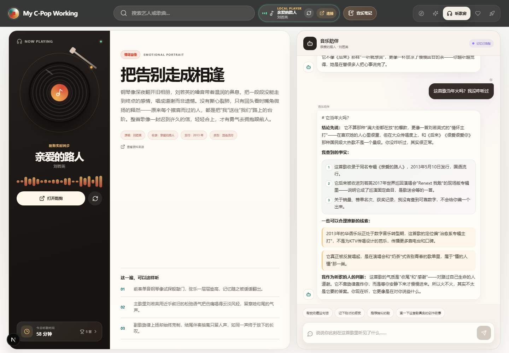
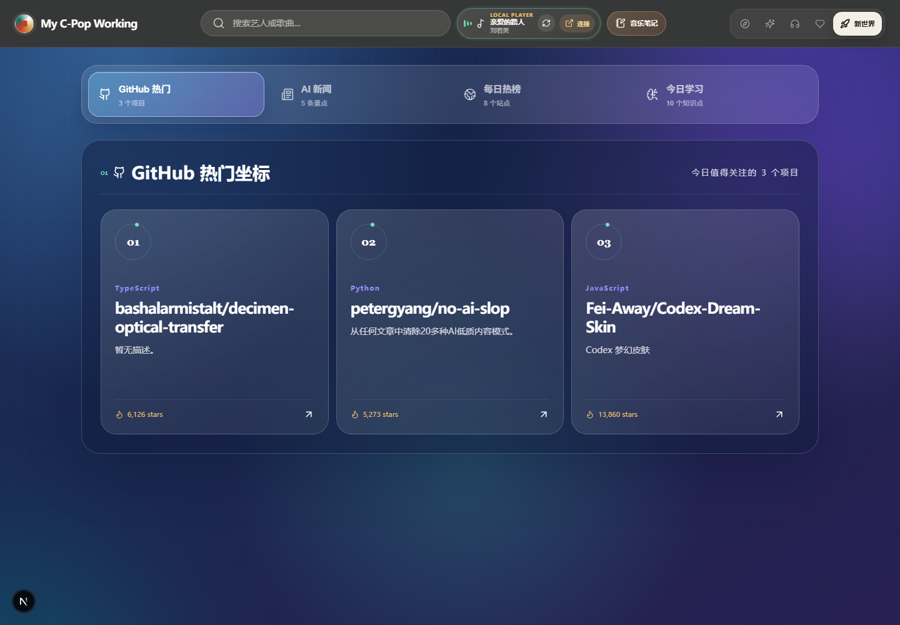

# C-Pop Atlas

> A production-minded AI music workspace for Chinese pop music, combining multi-agent orchestration, hybrid RAG retrieval, long-term memory, observability, and desktop integration.

[](https://github.com/yanhuachisha/my-cpop-working/actions/workflows/ci.yml)
[](https://www.python.org/)
[](https://www.oracle.com/java/technologies/javase/jdk17-archive-downloads.html)
[](https://nextjs.org/)
[](https://docs.docker.com/compose/)


## Why this project

C-Pop Atlas is an end-to-end demonstration of how an AI product moves from a user request to a traceable answer. It is designed as a real working system rather than a chat-only prototype:

- **User experience**: daily recommendations, listening history, notes, favorites, search, and a music relationship graph.
- **Agent platform**: bounded execution, token budgets, tool policies, structured observations, retries, and graceful degradation.
- **Retrieval and memory**: BM25 + vector search with ACL hard filters, plus a MySQL -> CDC -> RabbitMQ -> Elasticsearch memory projection pipeline.
- **Operations**: Lite, Full, and Observability Docker profiles with CI checks across Python, Java, and Next.js.

## Product tour

| Daily recommendation | Agent workspace |
| --- | --- |
|  |  |

| Listening room | Music graph |
| --- | --- |
|  |  |

## Architecture

```mermaid
flowchart LR
    U[User request] --> API[FastAPI Agent API]
    API --> PLAN[Bounded execution + token budget]
    PLAN --> RET[Hybrid retrieval\nBM25 + vector + ACL]
    RET --> CTX[Context assembly\nsummary + recent history]
    CTX --> LLM[LLM / deterministic fallback]
    LLM --> TOOLS[Tool registry + policy executor]
    TOOLS --> CORE[Java Music Core]
    CORE --> DB[(MySQL)]
    DB --> CDC[CDC worker]
    CDC --> MQ[RabbitMQ]
    MQ --> PROJ[Memory projector]
    PROJ --> ES[(Elasticsearch)]
```



Read the deeper design notes in [Agent Platform V3](./docs/AGENT_PLATFORM_V3.md) and the deployment guide in [DEPLOYMENT.md](./DEPLOYMENT.md).

## Quick start

### Docker (recommended)

```bash
git clone https://github.com/yanhuachisha/my-cpop-working.git
cd my-cpop-working
cp .env.example .env
docker compose --profile lite up --build
```

Open <http://localhost:3000>. The API documentation is available at <http://localhost:8000/docs>.

For the full interview/demo stack, including local models and observability:

```bash
docker compose --profile full --profile observability up --build
```

Windows PowerShell users can also run `./scripts/dev-up.ps1` for local development. See [QUICKSTART.md](./QUICKSTART.md) for manual frontend/backend startup and [DEPLOYMENT.md](./DEPLOYMENT.md) for profiles, ports, and cleanup.

## Engineering highlights

### Reliable agent execution

Each run carries a `run_id` and `trace_id`, with explicit step, deadline, token, and tool-call limits. Every tool call records structured input summaries, status, latency, and observations so a run can be inspected after the fact.

### Retrieval with security boundaries

BM25 and KNN retrieval apply ACL hard filters before fusion and reranking. Unauthorized documents never enter the candidate set, citation set, or trace output.

### Durable long-term memory

MySQL is the source of truth. Validated memory candidates are committed with an outbox record, projected through CDC and RabbitMQ, and indexed into Elasticsearch as a rebuildable search projection.

### Graceful degradation

The Lite profile runs without local model downloads. When an external dependency or LLM is unavailable, deterministic fallback paths keep the product usable and make the degraded dependency visible.

## Repository map

```text
backend/                 FastAPI API, agents, tools, retrieval, tests
frontend/                Next.js 16 + React 19 web application
services/music-core/     Java 17 Spring Boot source-of-truth service
services/cdc-worker/     Debezium Embedded CDC worker
services/memory-projector/Long-term memory projection into Elasticsearch
model-service/           Qwen3-0.6B + BGE-M3 model service
infra/                   MySQL and Prometheus configuration
data/                    Seed data and open-catalog artifacts
scripts/                 Startup, sync, indexing, and evaluation scripts
docs/                    Architecture, data sources, status, and benchmarks
```

## Verification

The CI workflow runs on every push to `main` and on pull requests:

```powershell
cd backend
pytest -q
ruff check .

cd ..\services\music-core
..\..\mvnw.cmd test

cd ..\..\frontend
npm ci
npm run build
```

The offline Agent smoke benchmark can be run with:

```powershell
python scripts/run_agent_eval.py --suite smoke --algorithm auto
```

See [Agent Benchmark Report](./docs/agent-benchmark-report.md) and [Project Status](./docs/project-status.md) for current evidence and known limitations.

## Data and compliance boundary

The project prefers public MusicBrainz, Wikidata, ListenBrainz, iTunes Search, and Deezer preview resources. It does not store complete lyrics or audio files, access private Apple Music data, or reverse-engineer private desktop databases. See [Data Sources](./docs/data-sources.md) for attribution and source-specific constraints.

## Roadmap

- Improve retrieval evaluation with a larger labeled benchmark.
- Add richer trace exploration and cost/latency dashboards.
- Expand provider adapters while keeping source attribution explicit.
- Publish signed, reproducible desktop releases for Windows.

## Contributing

Issues and pull requests are welcome. Please read [CONTRIBUTING.md](./CONTRIBUTING.md) before making a change. Security concerns should be reported privately according to [SECURITY.md](./SECURITY.md).

## License

This project is released under the [MIT License](./LICENSE).
